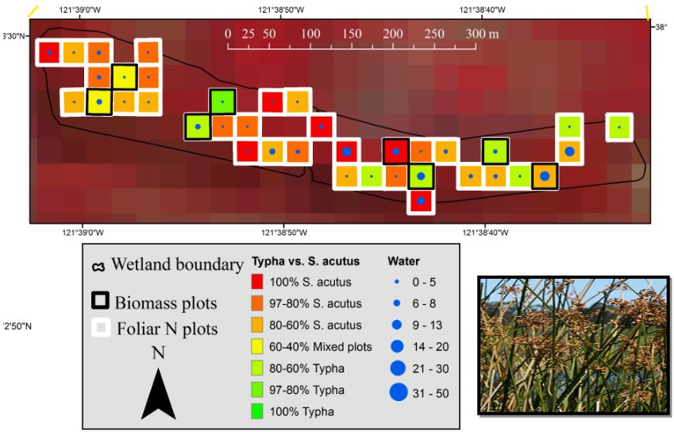
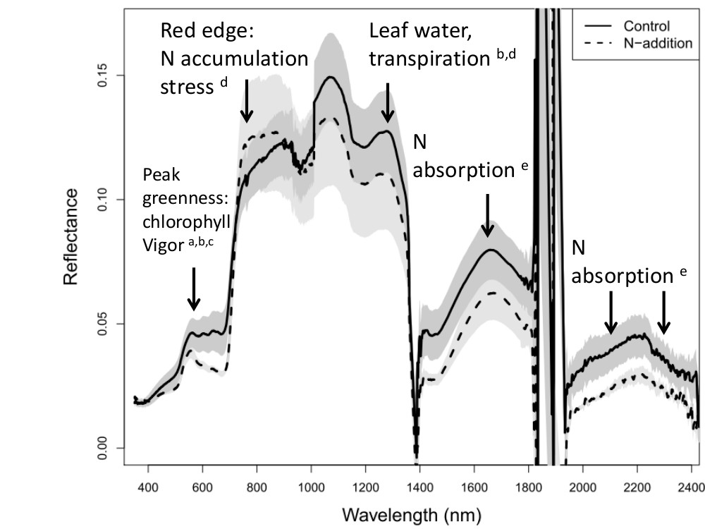
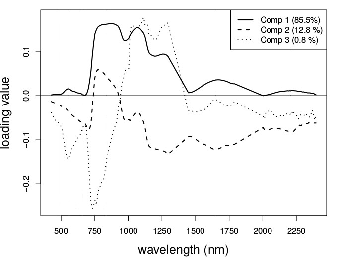
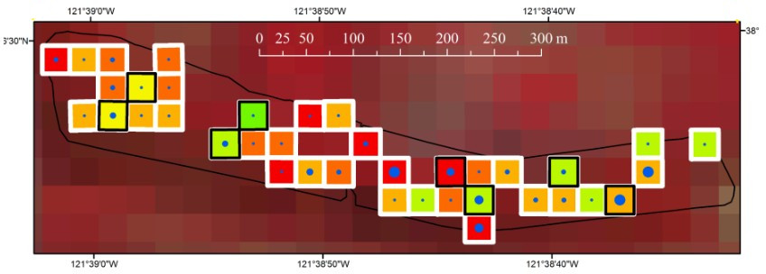
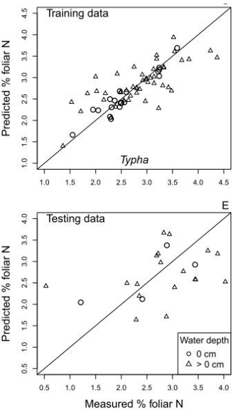

Intro to Modeling Field Remote Sensing Data
========================================================
autosize: true
transition: none
css: custom.css

Jessica L. O'Connell

Download/Install materials from **https://github.com/jloconnell/Model_field_RS_data_in_R**


Learning Objectives
==============
* Learn how to create remote sensing models in R
   * Basic: a linear model
   * Advanced: Partial Least Squares Regression
               Random Forests

Modeling overview
========================================================
* All models take some form of:

$$Response = \beta Predictors + \epsilon$$

where the predictors in remote sensing are often spectral indices or raw band data. This also be stated as:

$$Y = \beta X + \epsilon$$


Learning Objectives
==============
* Learn to model remote sensing data in R
   * **Basic**: a simple linear model
   * Advanced: Partial Least Squares Regression
               Random Forests


Simple Linear Model
========================================================

$$Response = \beta Predictors + \epsilon$$

or:

$$y = \beta_1 x + \beta_0 + \epsilon$$


```r
set.seed(1)
n<-30; b0<-0; b1<-2
x <- rnorm(n, mean=0.1, sd=0.25)
e <- rnorm(n, mean=0, sd=0.5)
y <- b0+b1*x+e
```

***

```r
plot(x,y, ylim=c(-4,4))
abline(b0,b1, lwd=2)
```


Simple Linear Model
========================================================

$$Response = \beta Predictors + \epsilon$$
$$y = \beta_0 + \beta_1 x + \epsilon$$


```r
set.seed(1)
n<-30; b0<-0; b1<-2
x <- rnorm(n, mean=0.1, sd=0.25)
e <- rnorm(n, mean=0, sd=0.5)
y <- b0+b1*x+e
```

- the line is the expected value of **y** given **x**
- if the model predicts the data well, the points will be close to the line
- the spread of the points is their variance

***

```r
plot(x,y, ylim=c(-4,4))
abline(b0,b1, lwd=2)
```


Simple Linear Model
========================================================

$$Response = \beta Predictors + \epsilon$$
$$y = \beta_1 x + \beta_0 + \epsilon$$


```r
set.seed(1)
n<-30; b0<-0; b1<-2
x <- rnorm(n, mean=0.1, sd=0.25)
e <- rnorm(n, mean=0, sd=2)
y <- b0+b1*x+e
```

- The fit of the model is worse when the spread about the line is higher
- This is the concept of explained variance, or in linear models, R^2


***

```r
plot(x,y, ylim=c(-4,4))
abline(b0,b1, lwd=2)
```


Simple Linear Model: Real example
==============
type: section

It's easier to learn by doing, so lets open the script called **linear_model_example.r**

Simple Linear Model: Real example
========================================================
* first, lets load and preprocess the data


```r
##load the libraries we need
library(readxl); library(caret); library(tidyverse) 
##set the working directory and load the data
setwd("/home/jessica/UGA/Teaching/Model_field_RS_data_in_R/R_code/") 
dat<-read.csv (file = "data/my_tidy_spectra.csv", header=TRUE, strings = F)
field<- read_excel("data/field_data.xlsx")
##prepare to merge by cleaning up date and making a merge key
dat$date<-as.Date(dat$date)
field$date<-as.Date(field$date, format="%m%d%Y")
field$key<-paste(field$plot, field$date)
dat$key<-paste(dat$plot, dat$date)
##remove key columns in one of the dataframes to avoid duplicates
field<-subset(field, select=-c(plot, date))
##check that key format is right
dat$key[1:3]; field$key[1:3]
```

```
[1] "m1 2016-05-03" "m1 2016-07-12" "m1 2016-08-18"
```

```
[1] "t1 2016-05-03" "t2 2016-05-03" "t3 2016-05-03"
```

Simple Linear Model: Real example
========================================================
* now merge the data


```r
##now merge the data
dat<-merge( field, dat, by="key")
##review the data
dim(dat);names(dat)[1:15]
```

```
[1]  54 225
```

```
 [1] "key"                   "veg__height_form"     
 [3] "avg_veg_height_cm"     "aboveground_biomass_g"
 [5] "plot"                  "date"                 
 [7] "X340"                  "X350"                 
 [9] "X360"                  "X370"                 
[11] "X380"                  "X390"                 
[13] "X400"                  "X410"                 
[15] "X420"                 
```


Simple Linear Model: Real example
========================================================
* now create the data columns we want to model


```r
##create the spectral bands we need, following the band guidelines in lab 1
dat$red<-dat$X670
##in lab 1, you explored NIR as the mean of several bands
dat$nir<-rowMeans(dat[, c("X790", "X800","X810", "X820")])

##calculate ndvi and rename the biomass column something easier to type
dat$ndvi<-(dat$nir-dat$red)/(dat$nir+dat$red)
dat$biomass<-dat$aboveground_biomass_g
```

Simple Linear Model: plot the data
========================================================
* lets examine the data patterns


```r
par(mar=c(4,4.5,0.5,0.5), oma=c(0,0.5,0.5,0.5),mfrow=c(1,1))
plot(dat$ndvi, dat$biomass, pch=19, cex=1.1, cex.lab=1.5, col=factor(dat$date))
legend("topright", legend=unique(dat$date), col=unique(factor(dat$date)), pch=19)
```


Simple Linear Model: create training data
========================================================
* lets divide the data into training and testing data


```r
library(caret)
set.seed(1)
# the p =xx below determines the proprotion of data to train on, here 70%
trainIndex <- createDataPartition(dat$biomass, p = 0.7, list = FALSE, times = 1)
as.numeric(trainIndex)[1:22]
```

```
 [1]  1  2  3  4  5  6  8  9 10 11 12 13 14 16 17 18 20 21 23 24 25 27
```

```r
train<-dat[trainIndex,c("plot","date","biomass", "red", "nir", "ndvi")]
test<-dat[-trainIndex,c("plot","date","biomass", "red", "nir", "ndvi")]
dim(train); dim(test)
```

```
[1] 40  6
```

```
[1] 14  6
```

```r
head(train);head(test)
```

```
  plot       date  biomass       red      nir      ndvi
1   m1 2016-05-03 214.3938  2.752857 11.84875 0.6229378
2   m1 2016-07-12 369.2427  4.182857 20.28219 0.6580544
3   m1 2016-08-18 252.0652 12.877143 36.68125 0.4803244
4   m2 2016-05-03 235.0303  4.257143 11.39750 0.4561175
5   m2 2016-07-12 242.9057  3.382857 16.83875 0.6654215
6   m2 2016-08-18 350.8669  8.532857 17.90156 0.3544131
```

```
   plot       date   biomass      red       nir      ndvi
7    m3 2016-05-03 166.15899 4.077143 14.434062 0.5594946
15   m5 2016-08-18  49.06635 4.585714 12.363437 0.4588857
19   s1 2016-05-03 206.24835 3.127143  8.624063 0.4677750
22   s2 2016-05-03 260.87487 5.748571 11.911563 0.3489776
26   s3 2016-07-12 287.02668 3.852857 14.687812 0.5843886
30   s4 2016-08-18  86.24575 6.188571 12.865938 0.3504350
```

Simple Linear Model: run the model
========================================================
* lets run a simple linear model on the training data


```r
summary(m<-lm(biomass~ndvi, data=train))
```

```

Call:
lm(formula = biomass ~ ndvi, data = train)

Residuals:
    Min      1Q  Median      3Q     Max 
-376.70 -162.59  -15.27  118.76  719.75 

Coefficients:
            Estimate Std. Error t value Pr(>|t|)    
(Intercept)   -290.0      134.6  -2.155   0.0375 *  
ndvi          1266.4      245.3   5.163 7.98e-06 ***
---
Signif. codes:  0 '***' 0.001 '**' 0.01 '*' 0.05 '.' 0.1 ' ' 1

Residual standard error: 230.6 on 38 degrees of freedom
Multiple R-squared:  0.4122,	Adjusted R-squared:  0.3968 
F-statistic: 26.65 on 1 and 38 DF,  p-value: 7.982e-06
```

* Note the R^2 of 0.41 and the model *P*-value of < 0.001


Simple Linear Model: check model assumptions
========================================================
* look for serious departures from the 1:1 line to indicate non-normality of residuals


```r
resids <- rstandard(m)
qqnorm(resids)
qqline(resids)
```


Simple Linear Model: Predict from the model
========================================================
* predict the data on the training and testing sets
* gather model summary data such as R^2 and Root Mean Squared Error

$$RMSE = \sqrt{ \frac{\Sigma_{i=1}^n (Pred_i - Observ_i)^2}{n} } $$


```r
##standardize the names for predicted and observed values
pred<-predict(m, newdata=train)
observ<-train$biomass

##calculate RMSE and save it
rmse<- round(sqrt(sum((pred-observ)^2)/length(pred)),1)
rmse
```

```
[1] 224.8
```

Simple Linear Model: Predict from the model
========================================================
* predict the data on the training and testing sets
* gather model summary data such as R^2 and Root Mean Squared Error


```r
##get R2 from the model and save it
mod.sum<-broom::glance(m); mod.sum
```

```
# A tibble: 1 x 11
  r.squared adj.r.squared sigma statistic p.value    df logLik   AIC   BIC
      <dbl>         <dbl> <dbl>     <dbl>   <dbl> <int>  <dbl> <dbl> <dbl>
1     0.412         0.397  231.      26.7 7.98e-6     2  -273.  553.  558.
# … with 2 more variables: deviance <dbl>, df.residual <int>
```

```r
r2<-as.numeric(round(mod.sum[1],2))
r2
```

```
[1] 0.41
```


Simple Linear Model: plot the training results
========================================================

* make a 1:1 plot of the observed vs predicted values


```r
##we want the x and y axis to have the same lengths
max<-max(c(pred, observ))
min<-min(c(pred, observ))

##plot the data and add a 1:1 line
plot(observ, pred, ylim=c(min,max), xlim=c(min,max), main="Training data")
abline(0,1)

##label the plot with the model summary stats
mtext(text= bquote(R^2 == .(r2) * "," ~~ RMSE == .(rmse) * " g"), side=3, line =-3, adj =0.05)
```
****


Simple Linear Model: plot the test results
========================================================
* repeat the code for the testing data
* we don't refit the model, we don't repeat the R^2 , we predict the testing data from the training model


```r
##we only have to replace train with test in a few places
pred<-predict(m, newdata=test)
observ<-test$biomass

##calculate RMSE and save it
rmse<- round(sqrt(sum((pred-observ)^2)/length(pred)),1)

##get R2 from the model and save it
mod.sum<-broom::glance(m); mod.sum
r2<-as.numeric(round(mod.sum[1],2))
max<-max(c(pred, observ))
min<-min(c(pred, observ))
plot(observ, pred, ylim=c(min,max), xlim=c(min,max), main="Testing data")
abline(0,1)
mtext(text= bquote(RMSE == .(rmse) * " g"), side=3, line =-3, adj =0.05)
```
****


Simple Linear Model: summary of data steps
========================================================
* create the spectral index you want to use for prediction (use rowMeans to take the average of several spectral bands if needed)
* divide data into training and testing data (createDataPartition in the caret package helps with this)
* build a linear model (function is lm()) using only the training data
* use the linear model built with the training data to predict the testing data without refitting the model

Simple Linear Model: what to report
========================================================
* R^2 , overall model *P*-value, RMSE for training and test data
* graphs of predicted vs observed values for training and testing data
* graphs of response (biomass) vs predictor (NDVI)
* potentially a graph of the model residuals, but normally a statement that they did not depart substantially from normality is enough

Limitations of linear models
========================================================
* In linear modeling, we choose some spectral information to use as predictors (example NDVI)
* We don't use all the spectral information because:
   - Each predictor inflates the R^2 , but may not increase prediction accuracy
   - With wide data (more predictors than observations), slope estimation is challenging
   - Predictors should be uncorrelated and independent from each other

Limitations of linear models
========================================================
* A **bad** linear model would be:

 $$Response = \beta_0 + \beta_1 band_1 + \beta_2 band_2 + ... + \beta_n band_n + \epsilon$$

* Similarly, we **should not** create models based on many correlated spectral indices

   $$Response = \beta_0 + \beta_1 NDVI + \beta_2 SAVI + ... + \beta_n AllTheIndices + \epsilon$$

* Instead we use expert knowledge or data mining to decide which spectral index to use, selecting those that have functional relationships with our response variable

Learning Objectives
==============
* Learn to model remote sensing data in R
   * Basic: a simple linear model
   * **Advanced**: Partial Least Squares Regression
               Random Forests


When Spectral Indices might not be enough
========================================================
* In some cases, we don't know which bands/indices to use
* There also may be multiple interacting processes driving prediction accuracy that can't be captured by a single spectral index
* In this case we may need the full spectrum, and linear modeling with spectral indices can't help


Example: Estimating Foliar N in Wetlands
========================================================

* We estimated N concentration in leaves of wetland plants
* Plots varied with respect to vegetation density, water depth, soil moisture



Example: Estimating Foliar N in Wetlands
========================================================

* Also leaf N is complicated to estimate



Partial Least Squares Regression
========================================================
* Is a multivariate ordination technique, similar to PCA
* Is robust to wide data, e.g., those with more columns than rows, common with hyperspectral data
* Is robust to correlated predictors
* Uses the entire spectral profile to make the prediction



Partial Least Squares Regression
========================================================
* Can maximize explained variation by helping parse out variation you're not interested in
   - Example: variation caused by differences in soil moisture



***




PLSR: Calculation
========================================================
Linear regression:  $$Y = \beta X + \epsilon$$

PLSR: Also regression, but first decompose X into orthogonal scores *T* and loadings *P* $$X = TP$$

* Basically, we use all of the band data to create a smaller subset of predictors, called **components**
* Though mathematically distinct, this is conceptually similar to creating NDVI out of red and NIR

***


PLSR: Calculation
========================================================
Linear regression:  $$Y = \beta X + \epsilon$$

PLSR: Also regression, but first decompose X into orthogonal scores *T* and loadings *P* $$X = TP$$

* Basically, we use all of the band data to create a smaller subset of predictors, called **components**
* Though mathematically distinct, this is conceptually similar to creating NDVI out of red and NIR

***
* Components are weighted combos of the bands
* In each component, the bands with a higher loading (weight) are more important for prection


PLSR: Calculation
========================================================

* The components (e.g., weighted band combos) are calculated such that:
      - they are not correlated with each other
      - the first one contains most of the explained variance for **Y**
      - they maximize explained variance

***


PLSR: summary of data steps
========================================================
* preprocess the data into the right format for the model
* divide data into training and testing data with the function **createDataPartition()** in the caret package
* build the model with the **plsr()** function
* keep only those components before the first major minima in RMSE (calculated for you) to avoid over-fitting
* use the model built with the training data to predict the testing data without refitting the model

PLSR: what to report
========================================================
* overall explained variance, the number of components kept, variance explained by each component, and RMSE for training and test data
* the plots of the loadings (weights) for each band against the wavelengths used for each component
* graphs of predicted vs observed values for training and testing data
* You should also provide an interpretation of why important bands (those with higher loadings/weights) are contributing to the prediction


Lets try this in R
==============
type: section

It's easier to learn by doing, so lets open the script called **plsr_example.r**
